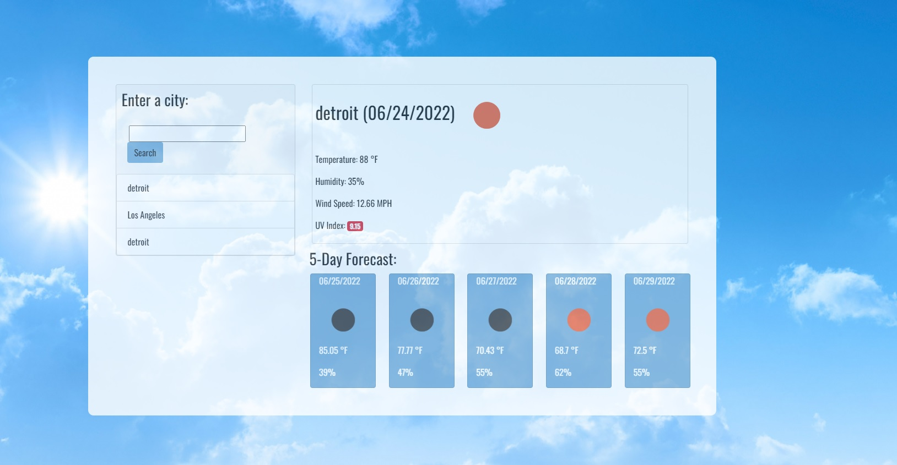

# Weather-Dashboard

## Description 
This project is an a website where user can see the Weather Forecast for a particular city. 
HTML, local CSS, bootstrap and JavaScript have been used to create this web app. 
JavaScript library Moment and Open Weather Map API has been used in building this project.

## Table of Contents
* [Usage](#usage)
* [Screenshot](#screenshot)
* [Author](#author)

## Usage 
App can be accessed on this [LINK](https://asidiki.github.io/Weather-Dashboard/) 

## Screenshot

## Author
Ansab Sidiki [Github](https://github.com/asidiki).